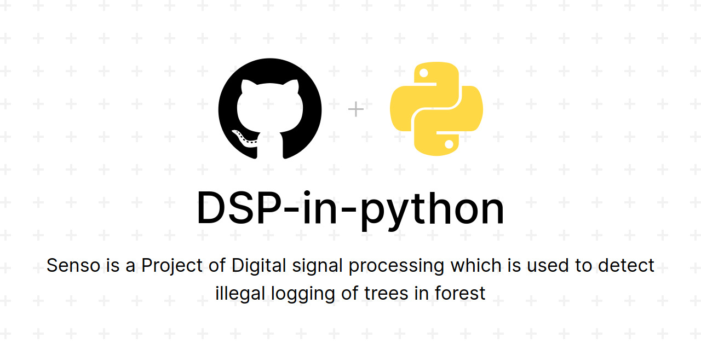

# Senso

# About the project
* Deforestation is one of the most significant problems our generation faces across the world. Deforestation is directly linked to climate change as burning down organic material releases a lot of carbon dioxide, a greenhouse gas. Forests are cut down throughout the world to make space for agricultural fields and housing. Intentional fires are put to clear out the forest and illegal logging happens on an international scale. Thus to encounter this problem we have come with a project named Senso, Senso is a project based on Digital Signal Processing, Our project aims to acumulate sound from the surrounding and check if it matches with the already availabe dataset of chainsaw or any other electronic equipment with which cutting of tree takes place.

# How it is working
* Every sound has some frequency component. This frequency component can be used to find similarities between sounds. The main concept of this project was to detect the frequency of chainsaw that is used for illegal logging of trees. Here we take two audio signal and correlate them, Correlation between signals gives the measure up to which the given signal resembles another signal. In other words, if we want to know how much similarity exists between the signals 1 and 2, then we need to find out the correlation of Signal 1 with respect to Signal 2 or vice versa. Here in this project we have taken some sound of chainsaw, birds and other noises that can come form forest and have combined them as a singal signal. After that we take another random signal and compare these signals. While comparing these signals we apply fast fourier transform on these signal, as signals are compared in frequency domain. After taking out the fast fourier transform of these signals we correlate them and after correlation the corrlation coffecient gives us a value between 0 and 1. If the value is more close to one then it means it has component of chainsaw more and vice versa. Below a few samples are given of some sounds which you can correlate with the main signal which has component of chainsaw more than other sounds and find the correlation along with frequency and time plots.
* We have provided some sounds on our website that we think can come from forest and you can check corrlation of those sounds with the original sound of chainsaw.
* After getting the value we can use it to determine if the sound we are having has a component of chansaw or not. If the value is close to 1 then it means it has frequency of chainsaw.
* We have set a threashold that is 0.8, if the corrlation value is above it we will notify the forest official about the place and can send them a detailed report of the graphs of time domain and frequency domain as evidence of the logging.
* Website link: https://calm-tor-31753.herokuapp.com

